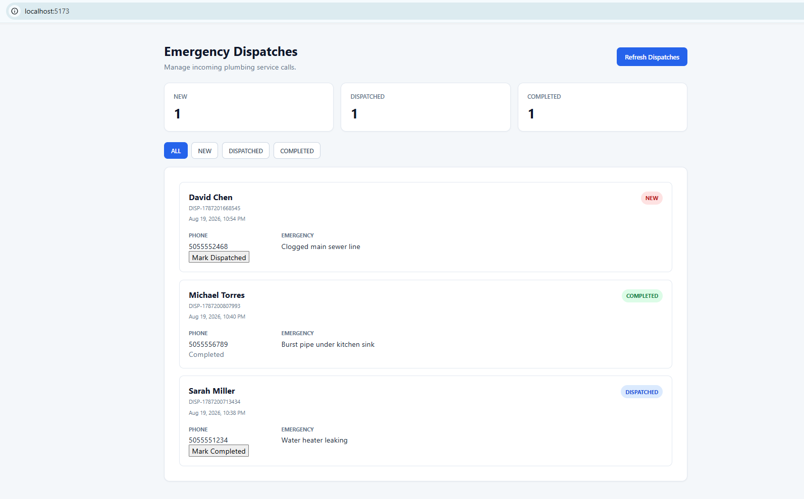

# Zach Plumbing AI Dispatcher

> **Note:** Zach Plumbing is a fictional company created for demonstration and portfolio purposes.

An AI-powered plumbing dispatch system built with Retell AI, Node.js, Express, MySQL, and React.

The project handles inbound calls, identifies emergency plumbing issues, collects customer information, sends dispatch data to a backend API, stores it in MySQL, and displays it in a React dashboard.

The system was tested end-to-end using a live Retell AI call, from voice intake through API processing, MySQL persistence, and dashboard display.

## Dispatch Dashboard



## How It Works

```text
Caller
  ↓
Retell AI Voice Agent
  ↓
Emergency Intake
  ↓
Express API
  ↓
Validation + Duplicate Protection
  ↓
MySQL
  ↓
React Dispatch Dashboard